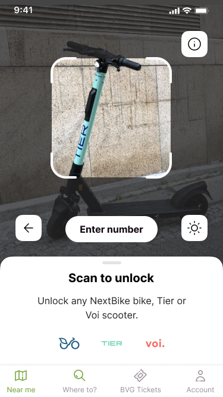
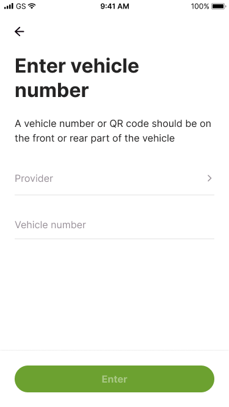

# QR scanner task

Trafi decided to make it easier for the users to rent a micromobility vehicles (such as bikes and kick-scooters). Our users should not be bothered with picking the right vehicle provider upfront and then using the camera to scan the QR. To make it easier we need you to implement a universal scanner feature.

## Goal

Write the logic for the QR scanner flow for an iOS app.

Your goal is to write correct and robust logic that correctly handles both the happy case and any errors. We will not be evaluating your UI or design chops.

Our designer has provided the following designs.

| QR code scanner | Manual code entry |
|:--:|:--:|
    |  

## Requirements

- Be sure to send scanned data and handle happy/unhappy paths' responses;
- The application should direct user to vehicle if code is recognized by the backend;
- If the user scans unknown vehicle we should show the error about unrecognized vehicle provider (alert is fine) and offer user to perform manual entry and provider selection;
- The QR scanners can encode plain numbers/characters and complete URLs. Be sure to encode URL if you recognized one in the QR code;
- Swift 5+
- iOS 12+ support
- iPhone